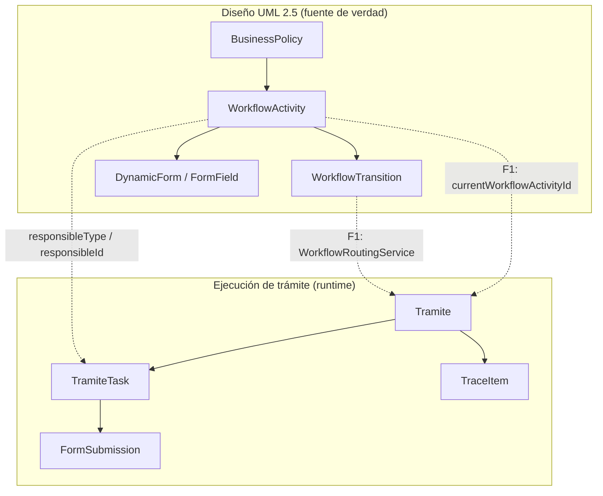

# Ciclo 1 — Modelo oficial de workflow (F0)

Documento de consolidación arquitectónica. **No reemplaza** el motor de enrutamiento (F1); define la fuente de verdad para el primer parcial.

## 1. Flujo correcto del ciclo 1



### Lectura del flujo

| Etapa | Entidad | Rol |
|-------|---------|-----|
| 1 | `BusinessPolicy` | Política activa que habilita trámites |
| 2 | `WorkflowActivity` | Nodos UML (START, TASK, DECISION, END) en swimlane vía `responsibleName` + `responsibleType` |
| 3 | `WorkflowTransition` | Aristas tipadas (secuencial, condicional, iterativa, paralela) |
| 4 | `Tramite` | Instancia de proceso para un solicitante |
| 5 | `TramiteTask` | Tarea asignada por actividad (bandeja del funcionario) |
| 6 | `FormSubmission` | Registro del trabajo realizado al completar una tarea |

**Regla ciclo 1:** el funcionario **no elige** la siguiente actividad; el sistema resuelve la arista según `WorkflowTransition` y datos del formulario (F1).

### Estado temporal (pre-F1)

`TramiteService` aún consulta `ActivityDiagram` (modelo B) o listas por defecto. Eso es **deuda técnica documentada**, no el modelo objetivo.

---

## 2. Clases oficiales del ciclo 1

### Diseño y definición del flujo

| Capa | Clases |
|------|--------|
| Modelo | `BusinessPolicy`, `WorkflowActivity`, `WorkflowTransition`, `DynamicForm`, `FormField` |
| Repositorio | `BusinessPolicyRepository`, `WorkflowActivityRepository`, `WorkflowTransitionRepository`, `DynamicFormRepository`, `FormFieldRepository` |
| Servicio | `BusinessPolicyService`, `WorkflowActivityService`, `WorkflowTransitionService`, `WorkflowDesignerService`, `DynamicFormService`, `FormFieldService` |
| API | `BusinessPolicyController`, `WorkflowActivityController`, `WorkflowTransitionController`, `WorkflowDesignerController`, `DynamicFormController`, `FormFieldController` |
| Constantes | `com.workflow.politicas.workflow.cycle1.Cycle1WorkflowModel`, `WorkflowTransitionType`, `WorkflowResponsibleType` |

### Ejecución y monitoreo (runtime oficial)

| Capa | Clases |
|------|--------|
| Modelo | `Tramite`, `TramiteTask`, `TraceItem`, `FormSubmission`, `ResponseItem` |
| Servicio | `TramiteService`*, `MyActivitiesService`, `MonitoringService`, `FormSubmissionService`, `KpiService`, `DashboardService`, `BitacoraService` |
| API | `TramiteController`, `MyActivitiesController`, `MonitoringController`, `FormSubmissionController`, `KpiController`, `DashboardController`, `BitacoraController` |

\* `TramiteService` es oficial de runtime pero **debe migrar su lectura de flujo** de B → A en F1.

### Colecciones MongoDB oficiales

`business_policies`, `workflow_activities`, `workflow_transitions`, `dynamic_forms`, `form_fields`, `tramites`, `form_submissions`, `bitacora`, `kpi_reports`

---

## 3. Clases deprecated (mantener código, no extender)

Marcadas con `@Deprecated(since = "0.0.1-cycle1-f0")` en el código.

### Modelo B — ActivityDiagram

| Clase | Motivo |
|-------|--------|
| `ActivityDiagram` | Sustituido por `WorkflowActivity` + `WorkflowTransition` |
| `DiagramNode`, `DiagramEdge` | Embebidos en B; no UML tipado del ciclo 1 |
| `ActivityDiagramService`, `ActivityDiagramController`, `ActivityDiagramRepository` | API paralela al diseñador oficial |
| `ActivityDiagramSaveRequest` | DTO de B |

### Modelo C — Legacy BPM

| Clase | Motivo |
|-------|--------|
| `WorkflowDiagram`, `Activity`, `Transition` | Diagrama BPM previo al diseñador UML actual |
| `ProcessInstance`, `TaskInstance` | Instancia/tarea paralela a `Tramite`/`TramiteTask` |
| `ProcessInstanceService`, `TaskInstanceService` | Motor legacy sin uso en Angular |
| `ActivityService`, `TransitionService`, `WorkflowDiagramService` | CRUD legacy |
| Controladores `/api/process`, `/api/tasks`, `/api/workflows`, `/api/activities`, `/api/transitions` | Sin consumo frontend ciclo 1 |

### Campos legacy en política

| Campo | Reemplazo conceptual |
|-------|---------------------|
| `BusinessPolicy.currentDiagramId` | Actividades por `policyId` en `workflow_activities` |

---

## 4. Compatibilidad temporal (no borrar en F0)

| Elemento | Política F0 |
|----------|-------------|
| REST `/api/activity-diagrams` | Sigue activo; usado por `form-designer` y `TramiteService` |
| REST `/api/process`, `/api/tasks` | Activos; sin clientes Angular |
| `Tramite.currentNodeId` | Sigue en uso (IDs de `DiagramNode`); F1 → `currentWorkflowActivityId` |
| Seeds Fase 3/4 | Poblan modelo A; trámites pueden ignorarlos hasta F1 |
| `DynamicForm` por `activityName` | Compatible con ejecución actual; F1 prioriza `activityId` |

### Riesgos de compatibilidad

1. **Nombres de actividad:** trámites y formularios enlazan por **string** (`activityName`); diseño oficial usa **ID** (`WorkflowActivity.id`).
2. **Dos diseñadores en frontend:** `workflow-designer` (A) vs `form-designer` + `ActivityDiagram` (B).
3. **Tareas por defecto:** sin diagrama B, `TramiteService` usa `DEFAULT_TASK_NAMES` (flujo demo distinto al seed de medidor).
4. **Transiciones condicionales:** definidas en A; avance en B solo toma la **primera** arista saliente.
5. **Auditoría dual:** `bitacora` (operativa) vs `audit_logs` (solo motor C).

---

## 5. Archivos que cambiarán en F1 (Motor workflow)

### Backend (prioridad alta)

| Archivo | Cambio esperado |
|---------|-----------------|
| `TramiteService.java` | Leer `WorkflowActivity`/`WorkflowTransition`; eliminar dependencia de `ActivityDiagram` |
| **Nuevo** `WorkflowRoutingService.java` | Resolver siguiente actividad (SEQUENTIAL, CONDITIONAL, ITERATIVE, PARALLEL_*) |
| `Tramite.java` | `currentWorkflowActivityId`; deprecar `currentNodeId` |
| `TramiteTask.java` | `workflowActivityId`, `assignedUserId` |
| `MyActivitiesService.java` | Bandeja por IDs y responsables tipados |
| `FormSubmissionService.java` | Validar por `activityId` |
| `KpiService.java` | Métricas sobre actividades oficiales |
| `Phase3MigrationService` / `Phase4MigrationService` | Alinear seeds con motor A |

### Backend (prioridad media)

| Archivo | Cambio |
|---------|--------|
| `ActivityDiagramService.java` | Adaptador de solo lectura o sync A→B (transitorio) |
| `DynamicFormService.java` | Una sola vía de resolución por `activityId` |
| `BusinessPolicy.java` | Dejar de escribir `currentDiagramId` |

### Frontend

| Archivo | Cambio |
|---------|--------|
| `tramites.component.ts`, `tramite-detail.component.ts` | Quitar avance manual del funcionario |
| `my-activities.component.ts` | Bandeja real + IDs |
| `form-execution.component.ts` | Formulario por `workflowActivityId` |
| `form-designer.component.ts` | Deprecar o redirigir a `activity-form-designer` |
| `workflow-designer.component.ts` | Sin cambio de modelo; opcional sync |

---

## 6. Migración ActivityDiagram → modelo oficial

### Estrategia recomendada (3 pasos)

**Paso 1 — Congelar B (F0, hecho)**  
Documentar B como deprecated; no eliminar APIs.

**Paso 2 — Exportador A→B transitorio (opcional, inicio F1)**  
Servicio `ActivityDiagramSyncService` que, dado `policyId`, genere `ActivityDiagram` desde `WorkflowActivity`/`WorkflowTransition` para no romper clientes que aún lean B. Solo para compatibilidad; no es fuente de verdad.

**Paso 3 — Motor solo A (F1)**  
`TramiteService` y `WorkflowRoutingService` leen únicamente colecciones `workflow_*`. `ActivityDiagram` queda sin escritura nueva.

### Mapeo conceptual

| ActivityDiagram (B) | WorkflowActivity (A) |
|---------------------|----------------------|
| `DiagramNode` tipo INITIAL | `activityType = START` |
| `DiagramNode` ACTION | `activityType = TASK` |
| `DiagramNode` DECISION | `activityType = DECISION` |
| `DiagramNode` FINAL | `activityType = END` |
| `node.lane` | `responsibleName` (swimlane) |
| `DiagramEdge` | `WorkflowTransition` con `transitionType` |

---

## 7. Preparación para tipos de flujo (F1)

Constantes en `WorkflowTransitionType`:

| Tipo | Uso en F1 |
|------|-----------|
| `SEQUENTIAL` | Una salida activa; avance automático al completar tarea |
| `CONDITIONAL` | Varias salidas; elegir por `conditionLabel` / respuestas de `FormSubmission` |
| `ITERATIVE` | Volver a actividad anterior hasta condición de salida |
| `PARALLEL_SPLIT` | Crear varias `TramiteTask` en paralelo (misma instancia, rama activa) |
| `PARALLEL_JOIN` | Esperar completitud de ramas antes de continuar |

`WorkflowRoutingService` (F1) recibirá: `policyId`, `currentActivityId`, `tramiteId`, `stepData` (respuestas formulario) → `RoutingDecision` (siguiente actividad o fin).

---

## 8. Dependencias actuales (análisis F0)

```
WorkflowActivityService ──► WorkflowActivityRepository, WorkflowTransitionRepository
WorkflowTransitionService ──► WorkflowActivityRepository, WorkflowTransitionRepository
WorkflowDesignerService ──► WorkflowActivityRepository, WorkflowTransitionRepository
DynamicFormService ──► WorkflowActivityRepository (oficial)

TramiteService ──► ActivityDiagramRepository, BusinessPolicyRepository  [B — migrar F1]
MyActivitiesService ──► TramiteService, FormSubmissionService  [indirecto B vía Tramite]
MonitoringService ──► TramiteRepository  [solo runtime Tramite]

ActivityDiagramService ──► ActivityDiagramRepository  [B deprecated]
ProcessInstanceService ──► Activity, Transition, WorkflowDiagram  [C deprecated, aislado]
```

---

## 9. Referencia en código

- Paquete Java: `com.workflow.politicas.workflow.cycle1`
- Frontend: `frontend/src/app/core/cycle1-workflow.model.ts`
- Diagrama PlantUML: `diagrams/arquitectura-ciclo1-workflow.puml`
